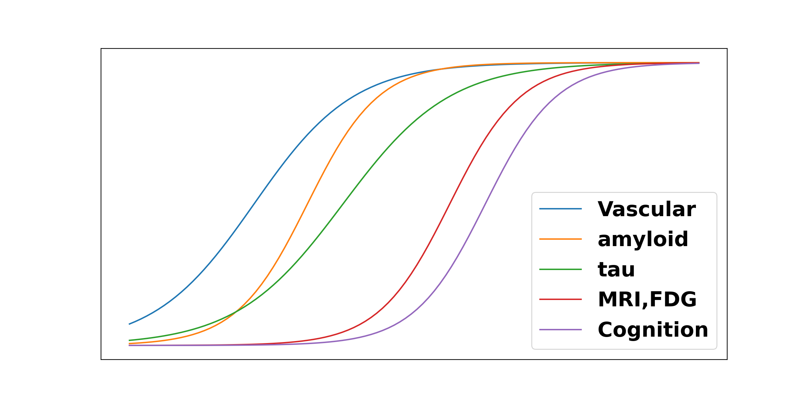

# Disease Progression Modelling

The Disease Progression Modelling community unites medics with researchers and engineers across the physical and life sciences to tackle some of the biggest challenges of 21st-century medicine by harnessing the power of mathematics, computer science, and data.

This website aims to serve as a portal into the world of Disease Progression Modelling, including multiple didactic tutorials for beginners.

## What is DPM?

Disease Progression Modelling (DPM), as we perceive it, has been around since approximately 2011. Computer science researchers took up the challenge of producing quantitative and actionable signatures of disease, inspired by the emerging hypothetical models of Alzheimer's disease progression at that time (Jack et al, 2010; Aisen et al., 2010; Frisoni et al., 2010) that look like the hypothetical cascade of dynamic biomarkers represented in the image below.

The snowstorm of data available to clinicians defies qualitative evaluation; the heterogeneity of data types complicates integration through traditional statistical methods; and the large datasets becoming available remain far from the big-data sizes necessary for fully data-driven machine-learning approaches. Data-driven DPM strikes a balance between imposed knowledge of disease features and patterns learned from data.

Nowadays there are a suite of DPMs available, with a variety of features and requirements, that are capable of answering a vast array of clinical and research questions --- often limited only by the data you have available. For a detailed review of key concepts in the development (and progression) of DPM, see ([Oxtoby and Alexander, "Imaging plus X...", Curr Opin Neurol 2017](https://doi.org/10.1097/WCO.0000000000000460)).

DPM has been empowered by the increasing availability of large medical datasets, particularly in neurodegenerative diseases like Alzheimer's, and the field is indebted to the volunteers who willingly provide their data for research.

Here we have assembled didactic materials for pioneering, and cutting-edge, approaches in DPM.
